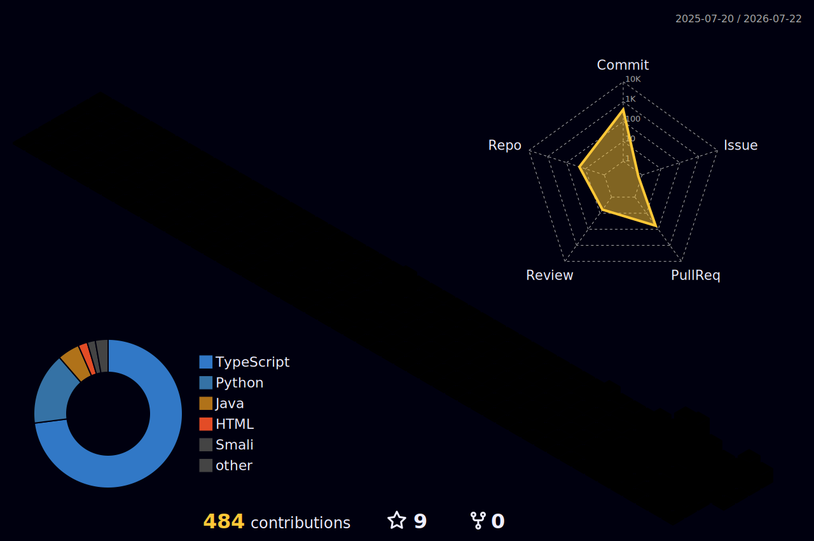

<!-- 打字特效 / readme-typing-svg -->

---

### 👋 About Me

- 🔭 I'm currently working on some interesting projects
- 🌱 I'm currently learning new technologies every day
- 💬 Ask me about anything tech-related
- 📫 How to reach me: [GitHub](https://github.com/Nnutural)
- ⚡ Fun fact: The best code is the code you don't have to write

<!-- 访客徽章 -->

---

### 📊 GitHub Statistics

<table>
  <tr>
    <td>
      
    </td>
    <td>
      
    </td>
  </tr>
  <tr>
    <td colspan="2" align="center">
      
    </td>
  </tr>
  <tr>
    <td colspan="2" align="center">
      
    </td>
  </tr>
  <tr>
    <td colspan="2" align="center">
      
    </td>
  </tr>
</table>

---

### 🛠️ Tech Stack

---

### 🐍 Contribution Snake

<picture>
  <source media="(prefers-color-scheme: dark)" srcset="https://raw.githubusercontent.com/Nnutural/Nnutural/output/github-contribution-grid-snake-dark.svg">
  <source media="(prefers-color-scheme: light)" srcset="https://raw.githubusercontent.com/Nnutural/Nnutural/output/github-contribution-grid-snake.svg">
  
</picture>

---

### 🧊 3D Contribution

---

Profile beautified following the <a href="https://zhuanlan.zhihu.com/p/741677397">超详细的 GitHub 个人主页美化教程</a> · Tokyo Night theme

